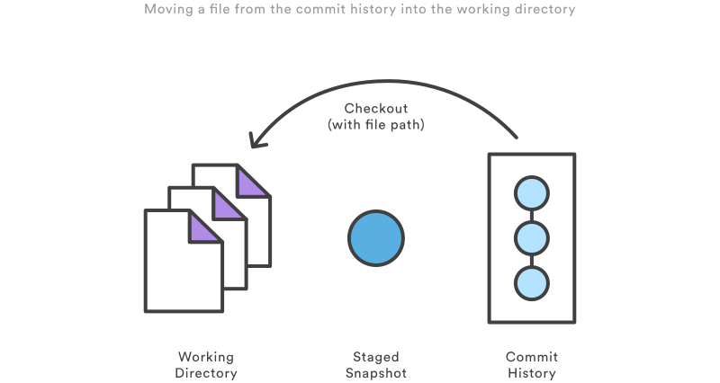
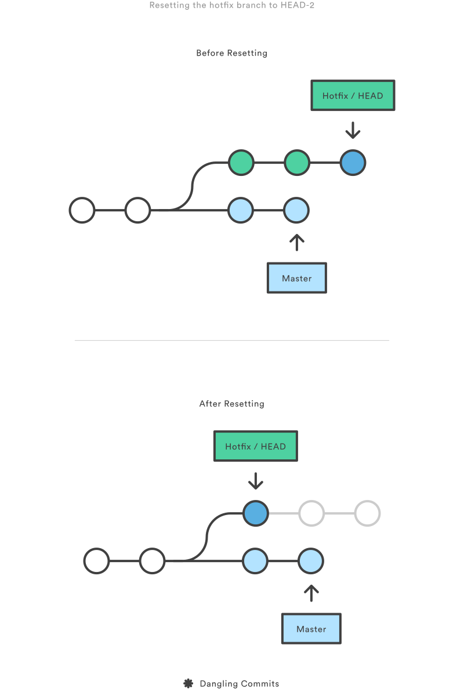
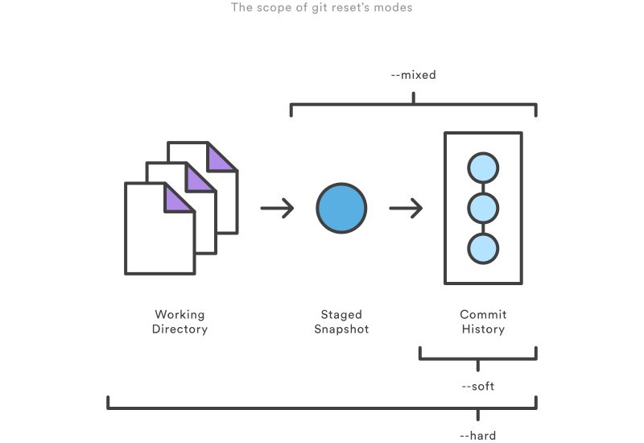
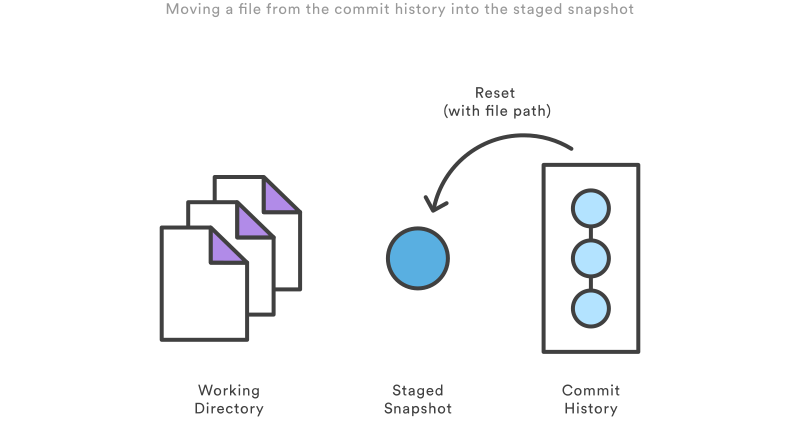
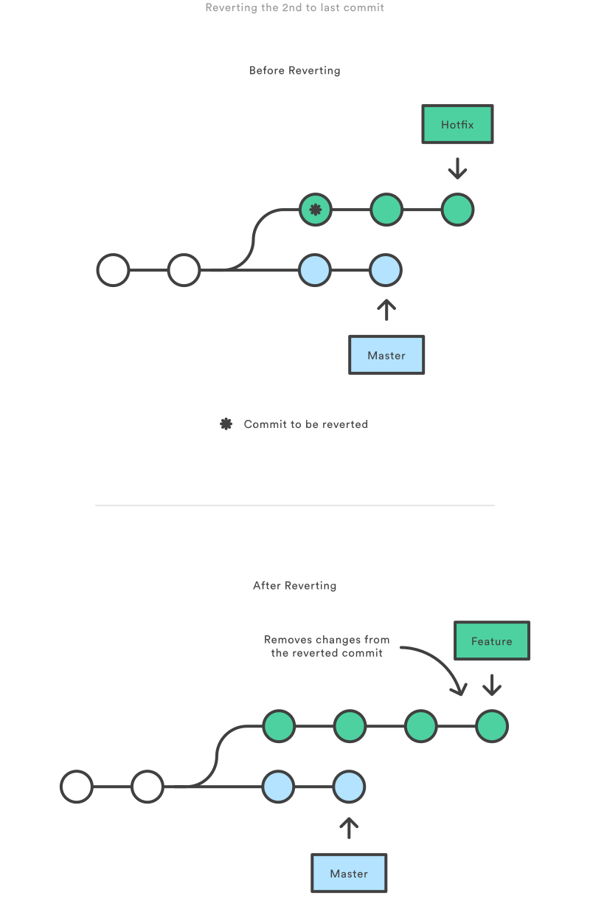
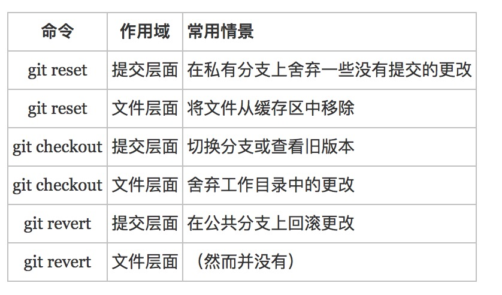

🐬🐬 欢迎评论和star 🐳🐳

### git命令行

1. git clone
    * 用于将远端仓库拷贝到本地
    * ssh: git clone username@host:/path/to/repository
    * https: git clone https:/path/to/repository.git

2. git config 
    * 这个命令定义了所有配置，从用户信息到仓库行为等等
    * git config --global --edit : 编辑器打开配置文件
    * git config --global user.name : 配置提交的用户名
    * git config --global user.email : 配置提交的邮箱

3. git add
    * 将本地工作区(Working dir)改变提交到缓存区(Index)
    * git add <file> : 提交确定文件
    * git add * : 提交所有更改
    * git add -A : 提交tracted和untracted中的文件提交到缓存区
    * git add -u : 提交tracted中的文件提交到缓存区
    * git add -p : 交互式提交

4. git commit
    * 将缓存的快照提交到项目历史
    * git commit -m "<message>" ： 提交已经缓存的快照。它会运行文本编辑器，等待你输入提交信息。当你输入信息之后，保存文件，关闭编辑器，创建实际的提交。

5. git status
    * 列出已缓存、未缓存、未追踪的文件（缓存区和工作区文件状态）
    * Changes to be committed: 文件在缓存区
    * Changes not staged for commit: 在工作区已经追踪的文件
    * Untracked files: 在工作区未追踪的文件

6. git log 
    * 命令显示已提交的快照

7. git checkout
    * 这个命令有三个不同的作用：检出文件、检出提交和检出分支
    * 提交层面
        + 移动HEAD指针到固定的提交
        + git checkout HEAD~2
        + git checkout <commit>

    * 文件层面
        + 用提交版本中的文件覆盖本地工作区的文件
        + git checkout HEAD~2 test.txt
        + git checkout HEAD <file> (常用)
    

        
    

    * 分支层面
        + 切换分支
        + git checkout <branch>

8. git reset
    * 修改提交版本，会删除提交历史（一定要谨慎），切记当把提交推送到远端后，禁止使用git reset
    * 提交层面

        + git reset --soft HEAD~2
        + git reset --soft <commit>

    

        
    

    除了在当前分支上操作，你还可以通过传入这些标记来修改你的缓存区或工作目录：

        * --soft – 缓存区和工作目录都不会被改变
        * --mixed – 默认选项。缓存区和你指定的提交同步，但工作目录不受影响
        * --hard – 缓存区和工作目录都同步到你指定的提交
         
    

        
    

        
    常用操作：

        * git reset --mixed HEAD / git reset HEAD
        * git reset --hard HEAD

    * 文件层面
        + 用提交版本中的文件覆盖缓存区的文件
        + git reset HEAD~2 text.txt
        + git reset HEAD <file>

    

        
    

9. git revert
    * Revert撤销一个提交的同时会创建一个新的提交。这是一个安全的方法，因为它不会重写提交历史。
    * git revert HEAD~2
        - 会找出倒数第二个提交，然后创建一个新的提交来撤销这些更改，然后把这个提交加入项目中。

    

        
    

10. git stash
    * git stash : 暂存当前正在进行的工作
    * git stash pop : 恢复暂存的文件
    * git stash list: 显示暂存栈中所有暂存的历史
    * git stash apply stash@{1} : 将指定暂存纪录恢复
    * git stash clear : 清空暂存栈

11. 简记图

    

12. 参考
[https://www.cnblogs.com/houpeiyong/p/5890748.html](https://www.cnblogs.com/houpeiyong/p/5890748.html)
[https://github.com/geeeeeeeeek/git-recipes](https://github.com/geeeeeeeeek/git-recipes)