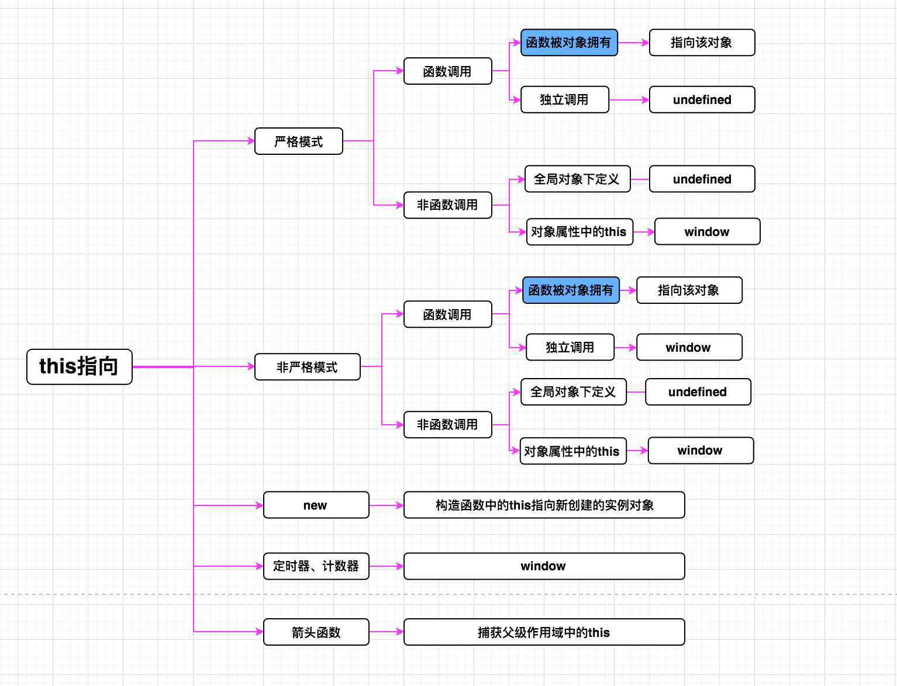

如题，this就是一个淘气鬼。

对此我想很多小伙伴都不会反对我，对吧？😘😘😘

在工作中我们经常被它搞得晕头转向的，一遇到this，首先闭目自问:
TND指向谁。明明觉得它指向a，怎么偏偏就指向了b。真是无语。😓😓😓

就这种情况，我是不能忍的，小样，竟敢这样戏耍我们玩JS的人，看我不整蒙你。

于是决心出这样一篇文章，分析this到底是什么，所有this指向的场景以及如何使用this，帮助大家彻彻底底的搞定this，希望大家多多支持！！！

### 探个究竟

关于this，我们放在嘴边的话就是：this指向谁。很少的小伙伴会想到，**this到底是什么**，**指向指的是什么**，以及**什么时候确定的指向**。

此时，给自己30秒钟的时间，想一想自己是否清楚我提的3个问题。

如果觉得自己对这些问题很清楚，我觉得应该为自己小小的高兴一下。

好了，我来回答下。

* 是个啥

	this是JavaScript里面定义的一个关键字，不能用做标识符。在函数中，是一个特殊对象。
	
* 指向是啥

	指向也作“引用”。JS中对象存在堆中，“this指向谁”也就是：this存储谁地址。也可以简单理解为某个函数名的别名（alias).
	
* 什么时候确定指向

	[原来JavaScript内部是这样运行的](https://github.com/prettyEcho/deep-js/issues/1) 中我们讲到，this指向的确定是发生在执行上下文的创建阶段，也就是说在函数调用以前，this到底指向谁，谁也不知道，而且一旦确定，便不可更改。
	
### 变来变去不累吗

> 《JavaScript高级程序设计》中说：this引用的是函数据以执行的环境对象。因此正是由于执行的环境对象飘忽不定，才导致this引用的对象“变来变去”。
	

#####  一、函数调用

* 函数被obj所拥有

	上面我们说到两点，可以为我们确定this指向提供理论依据：

	1. 函数执行的时候确定this指向 => this指向确定一定是在函数最终执行的位置
	2. 	this引用的是函数据以执行的环境对象 => this指向和函数的拥有者有密切关系

	结论：**this指向函数最终调用的拥有者** （记住这句话能帮你解决一半以上的this问题）

	严格模式：

	```	
	// 函数被obj所拥有
	"use strict"
	
	var a = 10;

	var obj = {
	    a: 20,
	    fn() {
	        console.log( this.a );
	    }
	}
	
	obj.fn(); // 20 this -> obj
	
	```
	
	非严格模式：
	
	```
	// 函数被obj所拥有
	var a = 10;

	var obj = {
	    a: 20,
	    fn() {
	        console.log( this.a );
	    }
	}
	
	obj.fn(); // 20 this -> obj
	```
* 独立调用 

	**1. 严格模式下，不管在哪独立调用this都指向undefined**
	
	**2. 非严格模式下，不管在哪独立调用this都指向window**
	
	严格模式：

	```	
	// 独立调用
	
	// demo1
	"use strict"
	
	var a = 10;

	function foo() {
	    var a = 20;
	
	    console.log( this ); // this -> undefined
	}
	
	foo();
	
	// demo2
	"use strict"
	
	var a = 10;
	
	function fn() {
	    var a = 20;
	    console.log( this ); // this -> undefined
	}
	
	function foo() {
	    var a = 30;
	    fn();
	}
	
	foo(); 
	
	```
	
	非严格模式：
	
	```
	// 独立调用
	
	// demo1
	var a = 10;

	function foo() {
	    var a = 20;
	
	    console.log( this.a ); 
	}
	
	foo(); // 10 this -> window
	
	// demo2	
	var a = 10;
	
	function fn() {
	    var a = 20;
	    console.log( this.a ); 
	}
	
	function foo() {
	    var a = 30;
	    fn();
	}
	
	foo(); // 10  this -> window
	```
	
#####  二、非函数调用

* 全局对象中的this

	[原来JavaScript内部是这样运行的](https://github.com/prettyEcho/deep-js/issues/1) 中我们强调过：**全局对象中this指向自身window**	
	
	严格模式：

	```
	"use strict"
	
	var a = 10;
	console.log( this ); // this -> undefined
	
	```
	非严格模式：

	```
	var a = 10;
	console.log( this.a ); // 10 this -> window
	
	```
	
* 对象属性中的this

	**不论在严格还是非严格模式下，对象中属性的this都指向window**
	
	严格模式：

	```
	"use strict"

	var a = 10;
	
	var obj = {
	    a: 20,
	    b: this.a + 10,
	    fn: function() {
	        console.log( this.b ); // 20 this -> window
	    }
	}
	
	obj.fn();
	```
	
	非严格模式：

	```
	var a = 10;
	
	var obj = {
	    a: 20,
	    b: this.a + 10,
	    fn: function() {
	        console.log( this.b ); // 20 this -> window
	    }
	}
	
	obj.fn();
	```

##### 三、 new操作符下的this

	**new把构造函数中的this指向新创建的实例对象**（如果不清楚可以去研究下new操作符具体都干了什么）
	
	```
	function People(name) {
	    this.name = name;
	}
	
	People.prototype.getName = function() {
	    return this.name;
	}
	
	var person = new People('echo');
	console.log( person.name ); // echo this -> person
	
	```
	

##### 四、特殊情况

* 定时器、计数器下的this

	**不论在严格还是非严格模式下，定时器、计数器下的this都指向window**

	```
	"use strict" (or none)

	var a = 10;
	
	function foo() {
	    var a = 20;
	
	    setTimeout(function() {
	        var a = 30;
	        console.log( this.a ); // 10 this -> window
	    })
	}
	
	foo();
	```

* DOM中的this

	**不论在严格还是非严格模式下，DOM事件中的this都指向该DOM元素对象**
	
	```
	// HTML
	
	<body>
	    <div id="test" style="width: 100px; height: 100px; background-color: red;" onclick="console.log( this.id );"></div>
	</body>
	
	// JS
	
	"use strict" (or none)
	
	var a = 10;
	var oDiv = document.querySelector('#div');
	
	/* 
	oDiv.onclick = function() {
	    var a = 20;
	    console.log( this ); // DOM(div)
	} */
	
	/*
	oDiv.addEventListener('click', function() {
	    var a = 20;
	    console.log( this ); // DOM(div)
	}) */
		
	```
	
##### 五、箭头函数中的this

箭头函数中的this可就神奇了，来来，我们一起看下。

准确的说，**箭头中并不存在this上下文**（真懒，嘿嘿，和我一样），它懒得自己生成this上下文，直接**捕获父级作用域中的this**。但是懒也有懒的好处，因为在定义的时候我们就能确定箭头函数中的this（词法作用域），而且也不会受到严格模式、call、apply、bind的限制。

说的什么鬼东西？

行，我们代码分析。

```
var a = 10;
var obj = {
    a: 20,
    fn: () => {
        var a = 30;
        console.log( this.a );
    }
}

obj.fn();
```
箭头函数fn向上寻找this，首先遇到obj，发现它不能构成作用域，也不会存在this，直接跳过，此时遇到全局window，发现其中的this，真好，拿过来，那么我们结果自然就是10.

我们想让结构是20，怎么办，继续看。

```
var a = 10;
var obj = {
    a: 20,
    fn: function() {
        (() => {
            var a = 30;
            console.log( this.a );
        })();
    }
}

obj.fn();
```
箭头函数开始向上寻找this，遇到函数作用域fn，发现其中有this上下文，今天真走运，刚出门就找到了，直接拿过来用，哈哈。所以自然而然箭头函数中的this就是函数fn中的this，通过上面的知识，我们知道fn中的this指向obj，因此自然而然输出20。

很简单是吧？

那么你分析下，下面这题输出什么？

```
var a = 10;
var obj = {
    a: 20,
    fn: function() {
        (() => {
            var a = 30;
            (() => {
                var a = 40;
                (() => {
                    console.log( this.a );
                })()
            })();
        })();
    }
}

obj.fn();
```

如果你的结果是20,那么恭喜你，箭头函数中的this问题，对你来说已经是小菜一碟了。
	
#### 总结

好累，this指向会出现这么多种情况，谁记得住，别急，所有你能想到的我都为你准备好了。（请叫我雷锋）

<p align="center">

</p>

### 你皮，任你皮

